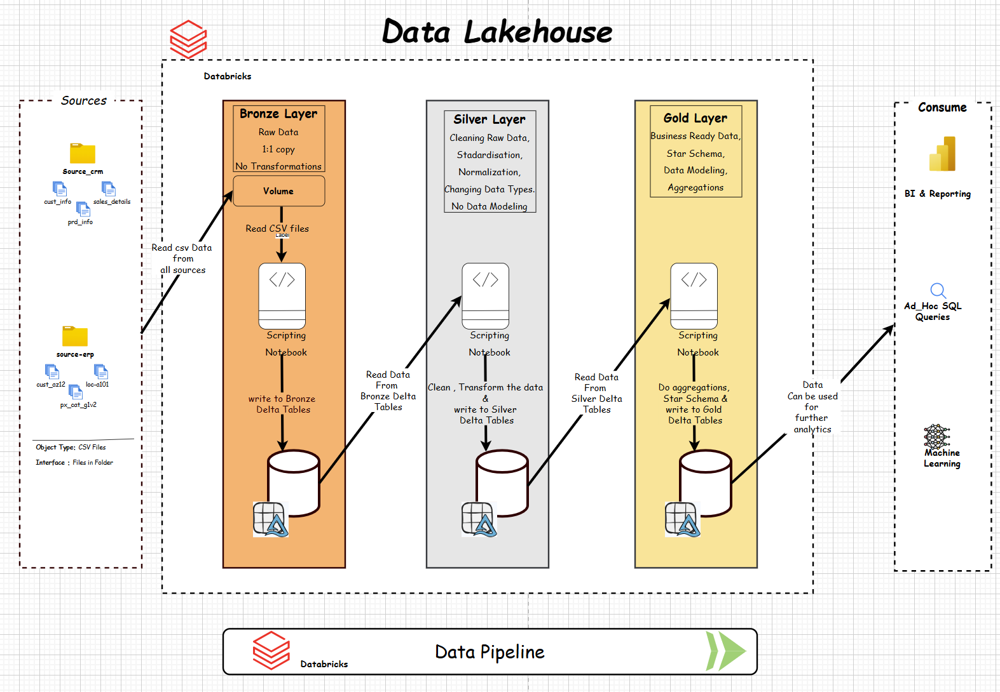

# databricks_lakehouse_DE_project
In this project, i have built **complete Data Lakehouse** from scratch using **Databricks** and the **Medallion Architecture**.

I have started with raw data and step by step transform it into clean, reliable, and business-ready datasets using the **Bronze, Silver, and Gold** layers. 

I have designed architecture, improved data quality, model data for analytics, and automate everything with pipelines and jobs.

By the end,  i had a production-style Lakehouse which can be used for further analytics.

## Data Architecture
